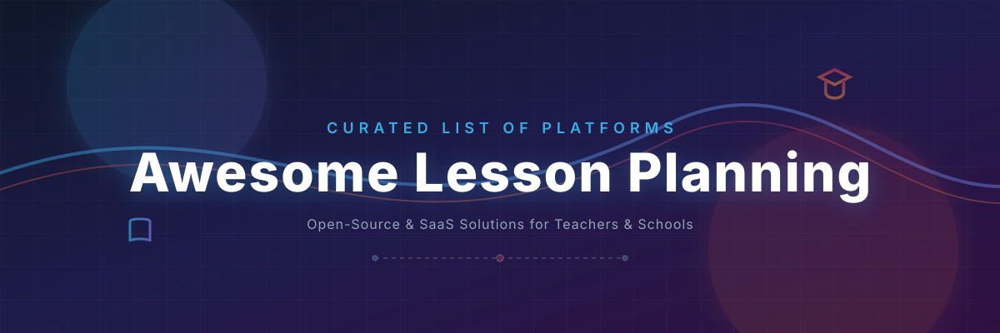

# Awesome Lesson Planning — Curated List of Lesson Planners, School ERPs, & LMS Platforms

Welcome to the ultimate curated directory of **lesson planning platforms**, **digital teacher planners**, **curriculum design software**, and **open-source learning management systems (LMS)**. This list helps educators, schools, and software developers find the best hosted SaaS and free open-source alternatives to streamline academic workflows.

## 🔍 Similar Projects to Lesson Planning Platforms

**Lesson Planning Platforms** help teachers create, organize, schedule, and share structured lesson plans, units, and curricula. Features often include calendars, standards alignment, resource attachment, collaboration, and sometimes integration with learning management systems (LMS). Leading commercial tools include PlanbookEdu, Chalk, Common Curriculum, Toddle, TeacherPlanner, Planboard, Otus, Google Classroom, Seesaw, and itslearning.

Below is a **curated list** of notable platforms and their open-source equivalents. Dedicated standalone open-source lesson planners are relatively few; the strongest options come from open-source LMS platforms, school management systems with planning modules, and lightweight tools built on Markdown or Nextcloud.

## 🏢 SaaS / Hosted Platforms

| Platform | Description | Pricing & Free Tier Limits | Company Size (Est. Revenue / Valuation) |
| :--- | :--- | :--- | :--- |
| **[Google Classroom](https://classroom.google.com/)** | Class management tool for assignment and content organization. | **Free** (Google Workspace for Education Fundamentals) / Paid domain-level upgrades | ~$307B Revenue (Parent Alphabet) / ~$2T Valuation |
| **[Seesaw](https://web.seesaw.me/)** | Student-centered portfolio and activity platform. | **Free** (Seesaw Starter: 1 class, 35 students, 35 activities) / Paid school/district plans via **Custom Quote** | ~$50M - $60M Revenue / $1B+ Valuation |
| **[Toddle](https://www.toddleapp.com/)** | All-in-one platform for planning, assessment, and portfolio work. | **No Free Tier** (School-wide subscription only) / **Custom Quote** | ~$13M - $14M Revenue / ~$100M Valuation |
| **[Chalk](https://www.chalk.com/)** / Planboard | Intuitive lesson planning tool with calendar views and sharing features. | **Free** for individual teachers / **Chalk Gold**: $9/month or $99/year | ~$6.8M Revenue |
| **[Otus](https://otus.com/)** | Learning and assessment platform with planning and data tools. | **No Free Tier** / **Custom Quote** | ~$5.4M Revenue / ~$17.3M Valuation |
| **[itslearning](https://itslearning.com/)** | Learning platform with planning, curriculum, and collaboration tools. | **No Free Tier** (Free demo available) / **Custom Quote** | ~$4.7M Revenue |
| **[PlanbookEdu](https://www.planbookedu.com/)** | Popular digital lesson planner focused on simple, calendar-based planning for teachers. | **Free** (Basic features; no exporting, copying, or collaboration) / **Premium**: $30/year | ~$171,000 Revenue |
| **[TeacherPlanner](https://www.teacherplanner.com/)** | Digital planners designed specifically for educators’ scheduling and lesson needs. | **14-day Free Trial** / **Paid Subscription** | <$150,000 Revenue (Est.) |
| **[Common Curriculum](https://www.commoncurriculum.com/)** | Collaborative lesson planning and curriculum design platform. | **Free** (Basic plan for individual planning) / **Cc Pro**: $5.59/month or $71.88/year | <$100,000 Revenue (Est.) |

## 🔓 Open-Source Software

- **[Open edX](https://github.com/openedx)**  — Scalable open-source platform originally from MIT/Harvard; strong for structured course and curriculum design.
- **[Moodle](https://github.com/moodle/moodle)**  — The most widely used open-source LMS. Highly customizable; teachers can structure courses, topics, activities, and resources in a way that supports detailed lesson and unit planning.
- **[Canvas LMS](https://github.com/instructure/canvas-lms)**  — Modern open-source LMS (open-core model) with clean course organization, modules, and planning-friendly structures.
- **[Chamilo](https://github.com/chamilo/chamilo-lms)**  — Lightweight, user-friendly open-source LMS suitable for course and lesson organization.
- **[Gibbon](https://gibbonedu.org/)**  — Flexible open-source school platform that supports planning, teaching, and assessment workflows.
- **[OpenSIS](https://github.com/OS4ED/openSIS)**  — Open-source student information and school management system that includes teacher tools for planning and grade management.
- **[GegoK12 Lesson Plan Module](https://github.com/Gego-K12/gegok12)**  — Part of the open-source GegoK12 school ERP (MIT). Provides structured, curriculum-aligned lesson planning, syllabus tracking, and sharing within a broader school management system.
- **[School Planner](https://github.com/holger-dev/schoolplanner)**  — Nextcloud app designed for teachers to plan courses, structure lessons (with topics, goals, markdown descriptions), manage recurring lessons, and optionally publish content for students.
- **[Teacher Planner (Obsidian)](https://github.com/nsderred/teacher-planner-obsidian)**  — Open-source Obsidian plugin that turns a Markdown vault into a full academic planner with timetables, periods, lessons, directed time tracking, and notes — fully local and private.
- Various AI-assisted and Markdown-based lesson planner projects on GitHub that generate outlines, slides, or structured plans using LLMs.

### 🛠️ Supporting Tools & Approaches
- **Nextcloud** + education apps — Many teachers use Nextcloud (open-source file sync and collaboration) together with notes, calendars, and apps like School Planner.
- Markdown-based systems (Obsidian, Logseq, or plain Git repositories) combined with templates for long-term curriculum and lesson archives.
- Open educational resource (OER) platforms and curriculum repositories that can be adapted into local planning workflows.

### 📋 Typical Open-Source Stack
1. **Core planning** — School Planner (Nextcloud), Obsidian Teacher Planner, or GegoK12
2. **Course delivery & structure** — Moodle, Canvas LMS, or Open edX
3. **Resource storage & collaboration** — Nextcloud or a Git-based Markdown vault
4. **Standards & sharing** — Export to PDF/Markdown or publish selected lessons

This combination gives teachers full ownership of their plans, no subscription fees, and the ability to customize workflows to their exact needs.

---

**🤝 How to contribute**  
Fork this repository, add a new project (with link + short description + category), and open a pull request.  
Prefer actively maintained open-source projects related to lesson planning, curriculum design, teacher planners, or education platforms with strong planning features.

**📄 License**  
This list is public domain / CC0. Feel free to copy into your own awesome list or README.

Star the projects you find useful — open tools help teachers focus more on teaching and less on proprietary software! 📚

